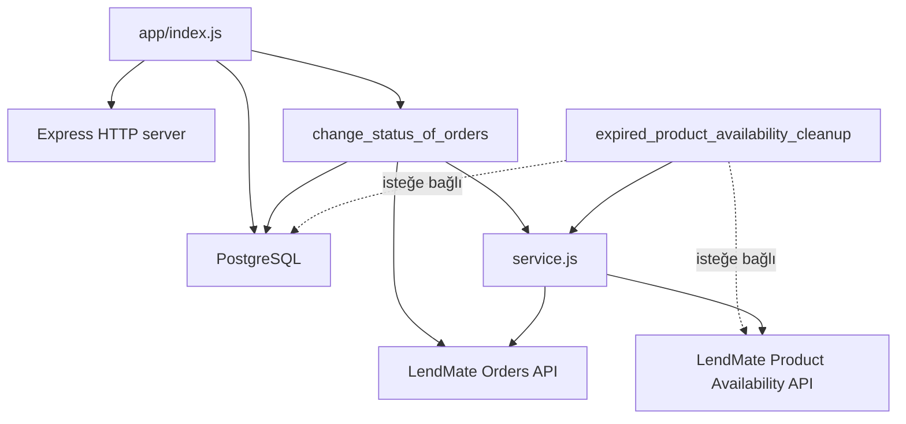

# Cron Jobs Service

HemenKirala ekosistemindeki zamanlanmış işleri çalıştıran küçük bir Node.js servisidir. Servis, cron ifadelerini PostgreSQL'deki `jobs` tablosundan okur ve zamanı geldiğinde ilgili HemenKirala API endpoint'lerini çağırır.

## Sorumluluklar

- Siparişleri `pending` durumundan `confirmed` durumuna geçirmek.
- Siparişleri `confirmed` durumundan `delivered` durumuna geçirmek.
- Süresi dolmuş kiralanmış ürünlerin uygunluk kayıtlarını temizlemek.
- Her işin son çalıştırılma zamanını `jobs.last_run_at` alanında güncellemek.
- Cron ifadesi veritabanında değiştirildiğinde servisi yeniden başlatmadan schedule'ı güncellemek.

> Not: `app/index.js` içinde `expired_product_availability_cleanup` job'ının başlatılması şu anda yorum satırındadır. Bu nedenle mevcut varsayılan çalışmada yalnızca `change_status_of_orders` job'ı başlatılır.

## Mimari



### Başlangıç akışı

1. `app/index.js`, Express uygulamasını ve PostgreSQL client'ını oluşturur.
2. PostgreSQL bağlantısı kurulmadan HTTP sunucusu ve cron job'ları başlatılmaz.
3. Bağlantı başarılı olunca `PORT` üzerinde Express sunucusu dinlemeye başlar.
4. Aktif sipariş job'ı, `jobs` tablosundan kendi cron ifadesini alır.
5. `node-cron` schedule'ı çalıştırır. Her 10 saniyede bir veritabanı tekrar kontrol edilir.
6. Cron ifadesi değişirse eski task durdurulur ve yeni task oluşturulur.

## Proje yapısı

```text
.
├── app/
│   ├── controller.js                         # Express route tanımları
│   ├── index.js                              # Uygulama giriş noktası
│   ├── repository.js                         # PostgreSQL bağlantısı
│   ├── service.js                             # API çağrıları ve job metadata güncellemesi
│   └── jobs/
│       ├── change_status_of_orders.js         # Sipariş durum geçişleri
│       └── expired_product_availability_cleanup.js
│                                                # Süresi dolan ürün uygunluğu temizliği
├── Dockerfile
├── docker-compose.yml
├── package.json
└── package-lock.json
```

### Katmanlar

- **Giriş katmanı:** `app/index.js` uygulamayı başlatır, veritabanına bağlanır ve job'ları devreye alır.
- **HTTP katmanı:** `app/controller.js` Express route'larını tanımlar. Mevcut `GET /` endpoint'i servis durumunu basit bir metinle yanıtlar.
- **Job katmanı:** `app/jobs/` veritabanından schedule okur, cron task'larını yönetir ve iş çalıştığında servis fonksiyonlarını çağırır.
- **Servis katmanı:** `app/service.js` dış API endpoint'lerine HTTP isteği gönderir ve çalıştırma zamanını veritabanına yazar.
- **Repository katmanı:** `app/repository.js` PostgreSQL `Client` bağlantısını yapılandırır.

## Cron job'ları

### `change_status_of_orders`

Aktif olduğunda aşağıdaki işlemleri sırasıyla çağırır:

1. `POST/GET` yöntemi API tarafında tanımlı endpoint'e göre belirlenmesi gereken `/orders/convert-pending-to-confirmed` endpoint'i.
2. `/orders/convert-confirmed-to-delivered` endpoint'i.
3. `jobs.last_run_at` alanının güncellenmesi.

Kod şu anda bu endpoint'lere HTTP metodu belirtmeden `fetch` ile istek gönderir; Node.js `fetch` varsayılan olarak `GET` kullanır. Endpoint'ler farklı bir metot bekliyorsa servis katmanında açıkça belirtilmelidir.

### `expired_product_availability_cleanup`

Etkinleştirildiğinde `/product-availability/internal/expired-rented` endpoint'ini çağırır ve başarılı iş akışından sonra `last_run_at` alanını günceller. Job kodu hazırdır ancak başlangıç dosyasında devre dışıdır.

Her iki job da `noOverlap: true` ile oluşturulur; önceki çalıştırma tamamlanmadan yeni bir çalıştırma başlatılmaz.

## Veritabanı beklentisi

Servis, aşağıdaki alanlara sahip bir `jobs` tablosu bekler:

- `name`: job adı (`change_status_of_orders` veya `expired_product_availability_cleanup`)
- `cron_expression`: `node-cron` tarafından doğrulanabilen cron ifadesi
- `is_active`: job'ın aktif olup olmadığını belirleyen boolean alan
- `last_run_at`: son başarılı çalıştırma zamanı

Job ifadeleri örneğin şu şekilde tutulabilir:

```sql
INSERT INTO jobs (name, cron_expression, is_active)
VALUES ('change_status_of_orders', '*/5 * * * *', true);
```

`cron_expression` değiştirildiğinde servis yaklaşık 10 saniye içinde yeni schedule'a geçer. Job pasif yapılır veya kaydı kaldırılırsa mevcut task durdurulur.

## Yapılandırma

### Ortam değişkenleri

| Değişken | Varsayılan | Açıklama |
| --- | --- | --- |
| `PORT` | `3000` | Express sunucusunun portu |
| `HOST_URL` | Yok | HemenKirala API'sinin temel URL'i |
| `DB_HOST` | `localhost` | PostgreSQL host'u |
| `DB_PORT` | `5432` | PostgreSQL portu |
| `DB_DATABASE` | `cron_jobs_service_db_dev` | Veritabanı adı |
| `DB_USER` | `lendmate` | PostgreSQL kullanıcı adı |
| `DB_PASSWORD` | `lendmate` | PostgreSQL parolası |

Yerel çalıştırmada değişkenleri shell ortamında tanımlayın. Docker Compose kullanıldığında veritabanı bağlantı değişkenleri compose dosyasında `postgres` servisine göre ayarlanmıştır.

## Çalıştırma

### Yerel geliştirme

```bash
npm ci
export HOST_URL=http://localhost:3001
export DB_HOST=localhost
export DB_PORT=5432
export DB_DATABASE=cron_jobs_service_db_dev
export DB_USER=lendmate
export DB_PASSWORD=lendmate
npm start
```

`npm start` nodemon kullanır ve kaynak değişikliklerinde servisi yeniden başlatır.

### Production

```bash
npm ci --omit=dev
npm run start:prod
```

Servis başladıktan sonra kontrol endpoint'i:

```bash
curl http://localhost:3000/
```

Beklenen yanıt:

```text
Hello World! Your Express server is running.
```

### Docker Compose

`docker-compose.yml`, servisi `lendmate-net` adlı harici Docker ağına bağlar. Ağı önceden oluşturun ve PostgreSQL ile aynı ağa bağlandığından emin olun:

```bash
docker network create lendmate-net
docker compose up --build -d
```

Compose yapılandırmasında PostgreSQL host'u `postgres` olarak ayarlanmıştır; bu adın aynı Docker ağı üzerindeki PostgreSQL container/service adıyla eşleşmesi gerekir.

## Teknoloji yığını

- Node.js 24 Alpine
- Express 5
- PostgreSQL ve `pg`
- `node-cron`
- `dotenv`
- Docker / Docker Compose

## Test ve gözlemlenebilirlik

Projede henüz otomatik test tanımlı değildir. `npm test` mevcut durumda bilinçli bir test çalıştırmaz ve `Error: no test specified` ile sonlanır.

Çalışma bilgileri container veya process stdout'una yazılır. Başlıca olaylar:

- PostgreSQL bağlantısı
- Sunucunun başlatılması
- Cron ifadesinin okunması ve yeniden yüklenmesi
- Cron task'ının çalışması
- Dış API ve veritabanı hataları
